# Student Registration System

A full-stack web and mobile application for managing student course registrations, built with Flutter for the frontend and Dart Shelf for the backend API.

## Overview

This system allows students to register, login, enroll in courses, view grades, and manage their academic profile. The application uses a RESTful API architecture with JWT authentication for secure access control.

## Git Branching Strategy

This project follows a structured branching workflow for better code management and deployment:

- **development**: Main development branch where all features are integrated and tested
- **staging**: Pre-production branch for final testing before deployment
- **production**: Stable production-ready code

Code flows from development → staging → production to ensure quality and stability.

## Technology Stack

### Frontend
- **Framework**: Flutter 3.x
- **State Management**: Provider pattern
- **HTTP Client**: http package for API communication
- **Platform Support**: Web, Windows, macOS, Linux, iOS, Android

### Backend
- **Framework**: Dart Shelf (lightweight web server)
- **Database**: MySQL/MariaDB
- **Authentication**: JWT (JSON Web Tokens)
- **Password Hashing**: BCrypt
- **Architecture**: RESTful API with MVC pattern

### Database
- **DBMS**: MySQL 8.0 / MariaDB 10.4+
- **Design**: Normalized relational database with foreign key constraints

## Architecture & Design Patterns

### Backend Architecture
- **Clean Architecture**: Separation of concerns with models, controllers, and routes
- **MVC Pattern**: Clear separation between data models, business logic, and routing
- **Middleware Pattern**: Reusable authentication and validation middleware
- **Singleton Pattern**: Database connection management

### Frontend Architecture
- **MVVM Pattern**: Models, Views, and ViewModels (via Provider)
- **Repository Pattern**: Centralized API service layer
- **Dependency Injection**: Using Provider for state management
- **Separation of Concerns**: Clear division between UI, business logic, and data layers

## Security Features

### JWT Authentication
The system implements token-based authentication using JWT:
- Tokens generated on successful login/registration
- Tokens stored securely on client-side
- All protected endpoints require valid JWT in Authorization header
- Token expiry: 24 hours
- Automatic token validation middleware on backend

### Password Security
- BCrypt hashing with salt rounds
- Passwords never stored in plain text
- Strong password validation on registration

### API Security
- CORS enabled for web applications
- Input validation on all endpoints
- SQL injection prevention through parameterized queries
- Error handling without exposing sensitive information

## RESTful API Design

The backend follows REST principles:

### Authentication Endpoints
- `POST /api/auth/register` - Create new student account
- `POST /api/auth/login` - Authenticate and receive JWT token
- `GET /api/auth/profile` - Get current student profile (requires auth)
- `PUT /api/auth/profile` - Update student profile (requires auth)
- `POST /api/auth/change-password` - Change password (requires auth)

### Course Endpoints
- `GET /api/courses` - List all courses
- `GET /api/courses/available` - List courses with available seats
- `GET /api/courses/:id` - Get specific course details
- `GET /api/courses/:id/assignments` - Get course assignments and grades

### Enrollment Endpoints
- `GET /api/enrollments/my-courses` - Get student's enrolled courses
- `POST /api/enrollments/:courseId` - Enroll in a course
- `DELETE /api/enrollments/:courseId` - Drop a course
- `GET /api/enrollments/grades` - Get all grades

All responses follow consistent JSON format:
```json
{
  "success": true/false,
  "message": "Description",
  "data": { ... },
  "statusCode": 200
}
```

## Application Flow

### 1. Splash Screen
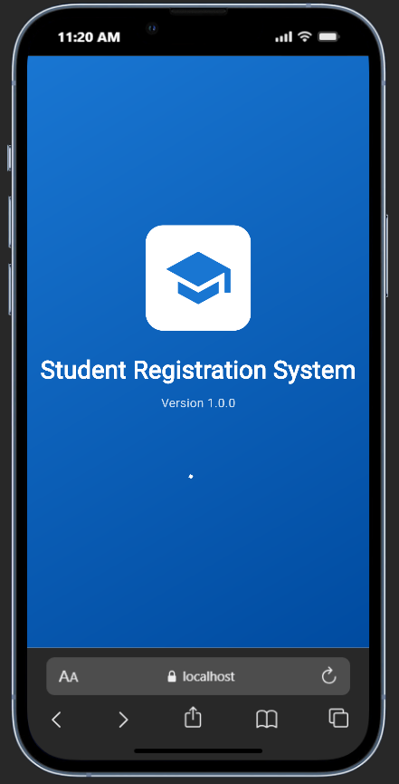
*Initial loading screen displayed when app starts*

### 2. Registration
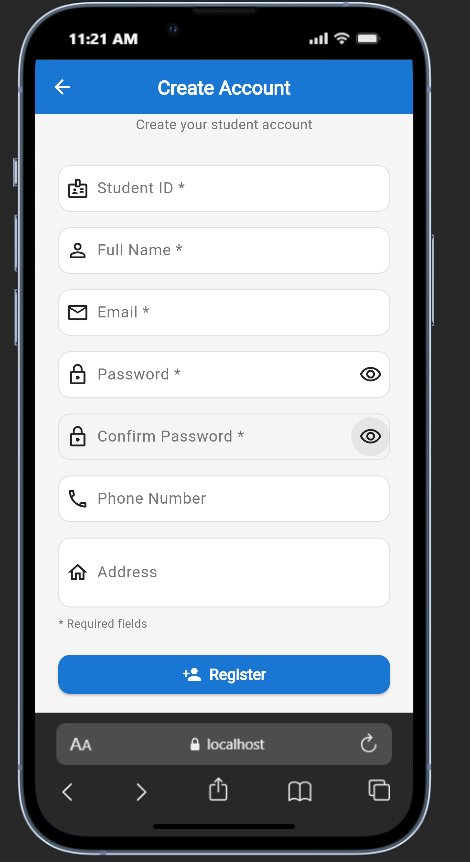
*New students can create an account with their details including student ID, name, email, phone, and address*

### 3. Login
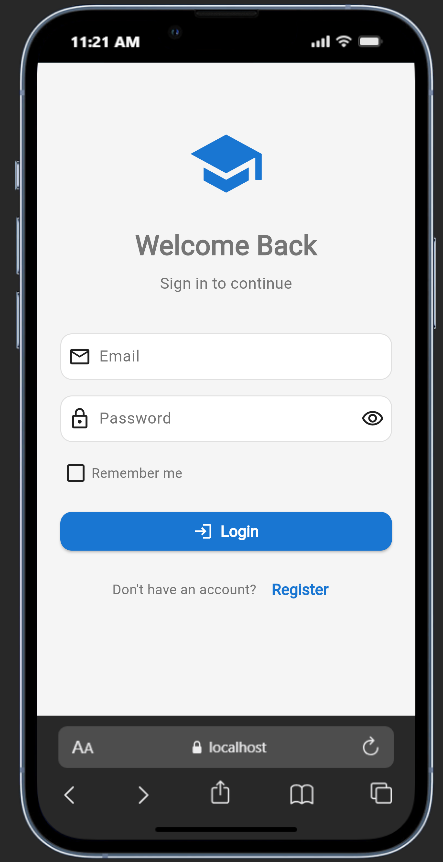
*Registered students login with email and password to access the system*

### 4. Home Screen

*Dashboard showing enrolled courses and quick actions*

### 5. Course Browsing
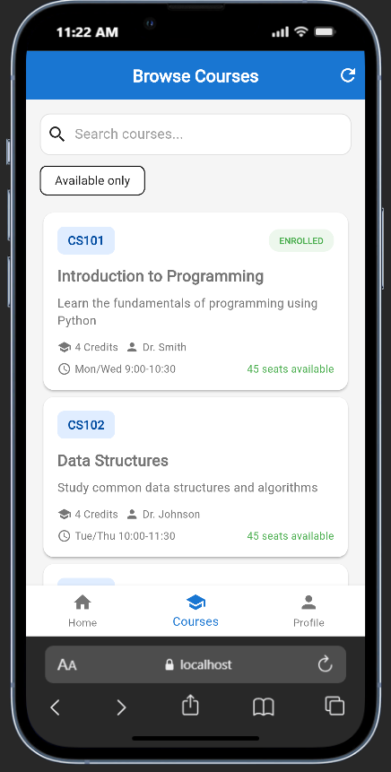
*Browse all available courses with search functionality to find specific courses*

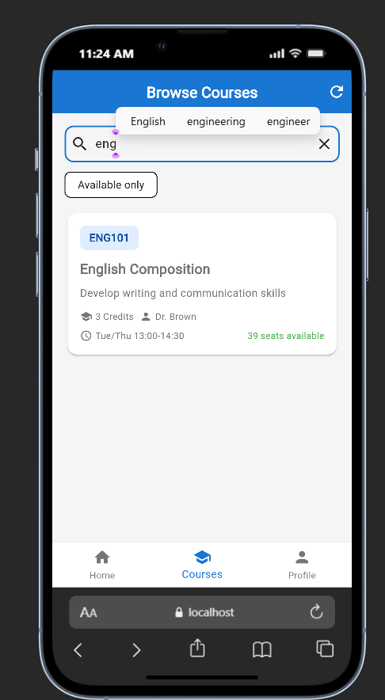
*Real-time search to filter courses by name or code*

### 6. Course Details
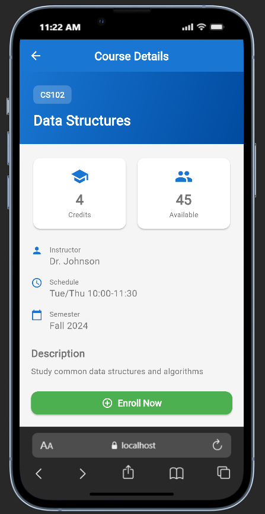
*View detailed information about a course including instructor, credits, schedule, and available seats*

### 7. Course Enrollment
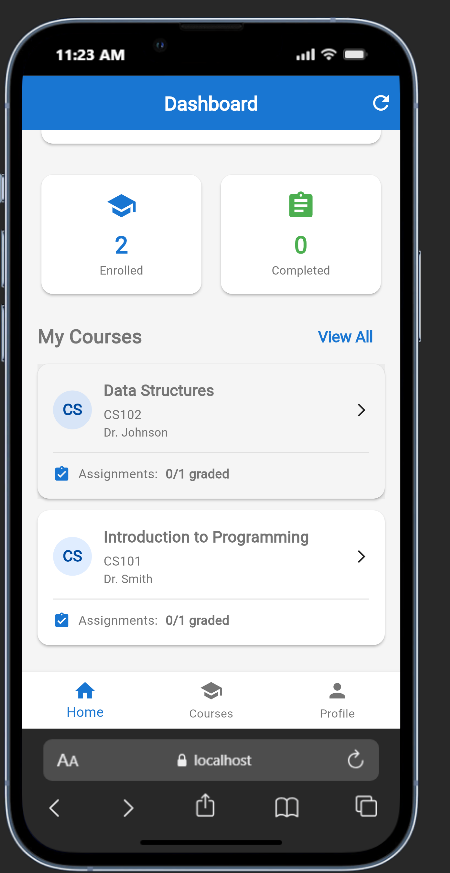
*After enrolling, the course appears on the home screen*

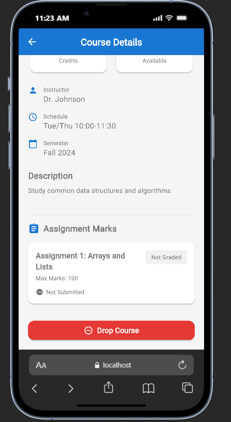
*The enroll button changes to "Drop Course" after successful enrollment*

### 8. Drop Course
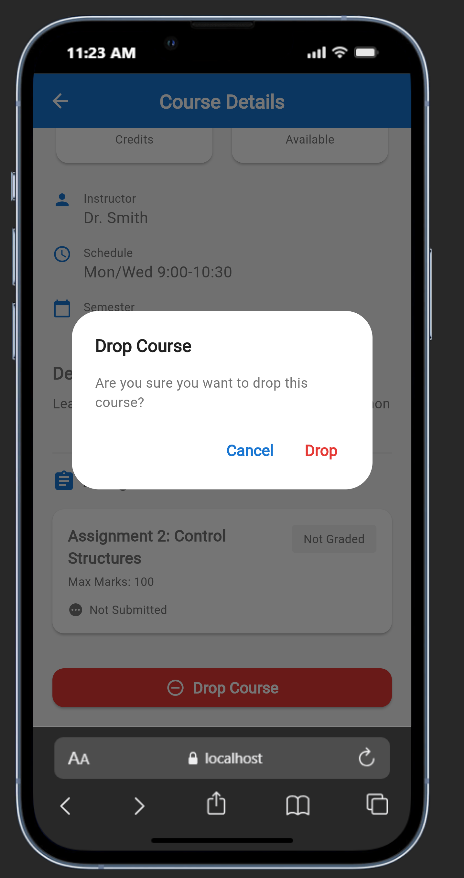
*Students can drop courses they are enrolled in*

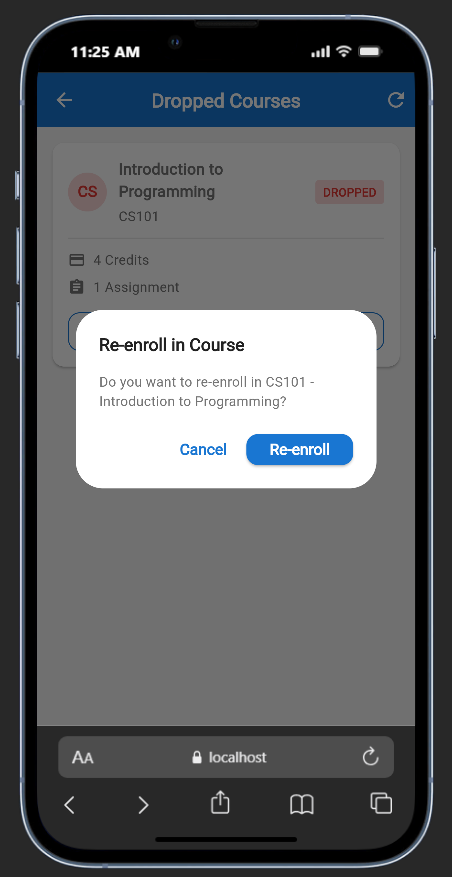
*Confirmation dialog when re-enrolling in a course*

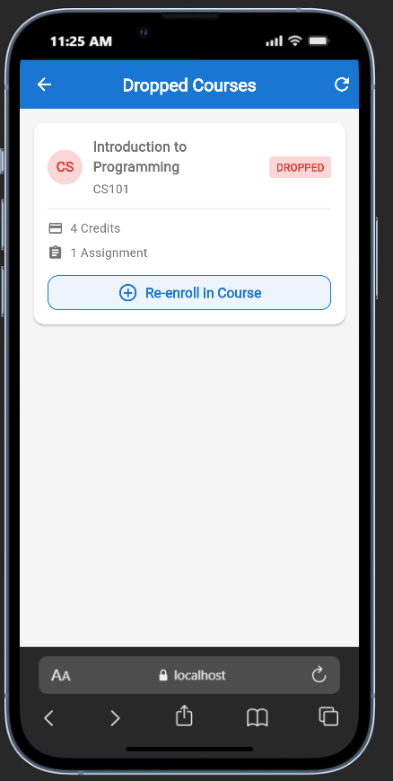
*Successfully re-enrolled in a course*

### 9. View Grades
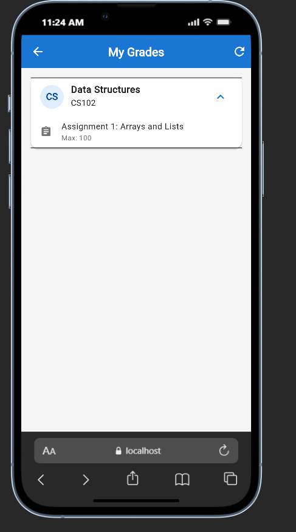
*View assignment grades and marks for enrolled courses*

### 10. Profile Management
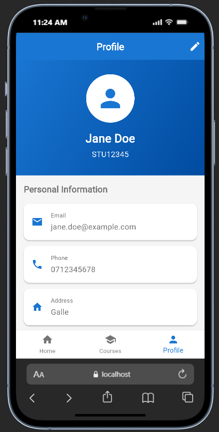
*View student profile information*

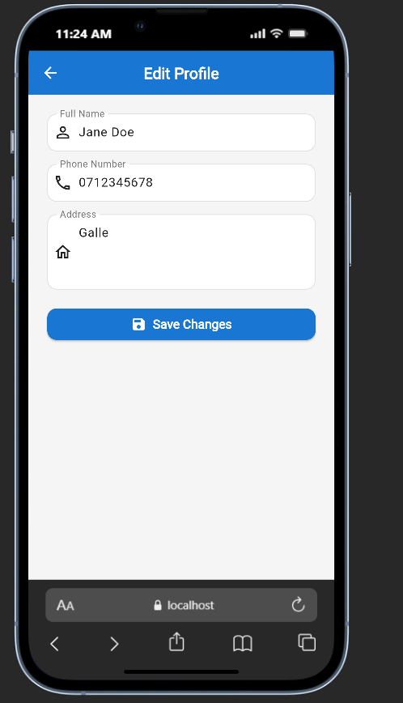
*Update personal information like name, phone, and address*

### 11. Notifications
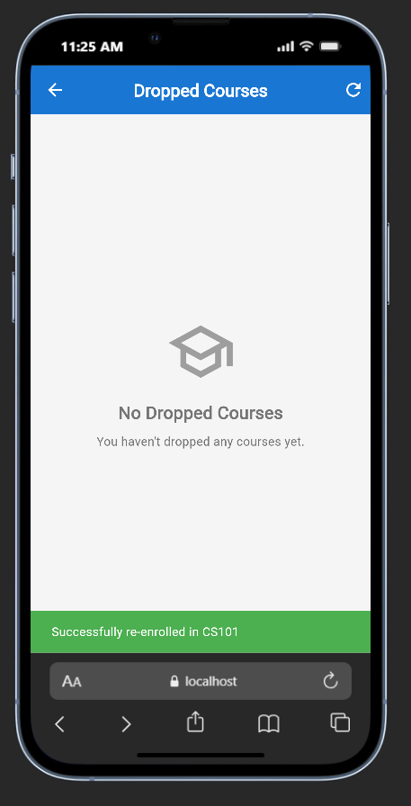
*Receive system notifications about enrollments and course updates*

### 12. Logout
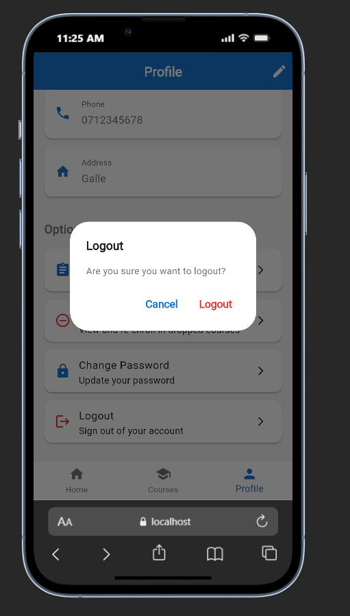
*Securely logout from the application*

## Database Schema

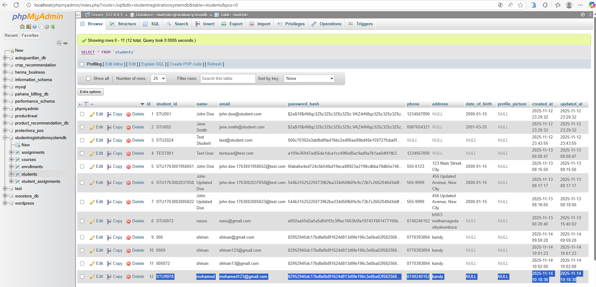
*Database structure with tables for students, courses, enrollments, and assignments*

### Tables
- **students**: Student account information
- **courses**: Course catalog
- **enrollments**: Student-course registrations
- **assignments**: Course assignments and grades

## Installation & Setup

### Prerequisites
- Flutter SDK (3.0 or higher)
- Dart SDK (2.19 or higher)
- MySQL or MariaDB (8.0+ or 10.4+)
- XAMPP (optional, for local MySQL)

### Backend Setup

1. **Install Dependencies**
   ```bash
   cd backend
   dart pub get
   ```

2. **Configure Database**
   - Create a MySQL database named `studentregistrationsystemdb`
   - Import the database schema (create tables)
   - Update `.env` file with your database credentials:
   ```
   DB_HOST=127.0.0.1
   DB_PORT=3306
   DB_NAME=studentregistrationsystemdb
   DB_USER=root
   DB_PASSWORD=
   SERVER_PORT=8080
   SERVER_HOST=localhost
   JWT_SECRET=your_secret_key_here
   JWT_EXPIRY_HOURS=24
   ```

3. **Run Backend Server**
   ```bash
   dart run bin/server.dart
   ```
   Server will start on `http://localhost:8080`

### Frontend Setup

1. **Install Dependencies**
   ```bash
   cd student_registration_app
   flutter pub get
   ```

2. **Update API Configuration**
   - Open `lib/data/services/api_service.dart`
   - Update `baseUrl` if needed (default: `http://localhost:8080/api`)

3. **Run Application**

   For Web:
   ```bash
   flutter run -d chrome
   ```

   For Windows:
   ```bash
   flutter run -d windows
   ```

   For Mobile (with emulator/device connected):
   ```bash
   flutter run
   ```

## Dependencies

### Backend Dependencies
```yaml
dependencies:
  shelf: ^1.4.0
  shelf_router: ^1.1.0
  mysql1: ^0.20.0
  bcrypt: ^1.1.3
  dart_jsonwebtoken: ^2.7.1
  dotenv: ^4.1.0
```

### Frontend Dependencies
```yaml
dependencies:
  flutter:
    sdk: flutter
  provider: ^6.0.5
  http: ^1.1.0
  shared_preferences: ^2.2.2
  intl: ^0.18.1
  file_picker: ^6.1.1
```

## Features

- User authentication with JWT
- Student registration and profile management
- Course browsing with search functionality
- Course enrollment and drop functionality
- Grade viewing for enrolled courses
- Assignment tracking
- Responsive UI for multiple platforms
- Real-time data synchronization
- Secure password storage
- Session management

## Project Structure

```
student-registration-system/
├── backend/
│   ├── bin/
│   │   └── server.dart           # Entry point
│   ├── lib/src/
│   │   ├── models/               # Data models
│   │   ├── controllers/          # Business logic
│   │   ├── routes/               # API routes
│   │   ├── middleware/           # Auth & validation
│   │   └── config/               # Database config
│   └── .env                      # Environment variables
├── student_registration_app/
│   ├── lib/
│   │   ├── data/
│   │   │   ├── models/           # Data models
│   │   │   └── services/         # API services
│   │   ├── providers/            # State management
│   │   └── ui/
│   │       ├── pages/            # App screens
│   │       └── widgets/          # Reusable components
│   └── pubspec.yaml
└── screenshots/                  # Application screenshots
```

## Development Notes

### Running in Development Mode
- Backend runs on port 8080
- Frontend connects to localhost:8080
- Hot reload enabled for quick development

### Testing
- Test API endpoints using the provided curl commands or Postman
- Frontend testing done manually through app usage
- Database testing done through direct queries

## Troubleshooting

### Common Issues

1. **Backend won't start**
   - Check if port 8080 is available
   - Verify MySQL service is running
   - Check database credentials in `.env`

2. **Frontend can't connect to backend**
   - Ensure backend server is running
   - Check API URL in `api_service.dart`
   - Verify CORS settings in backend

3. **Database connection errors**
   - Confirm MySQL is running
   - Check database exists
   - Verify user permissions

4. **JWT token errors**
   - Token might be expired (24 hour expiry)
   - Re-login to get new token
   - Check JWT_SECRET is set correctly

## Future Enhancements

- Email verification for registration
- Password reset functionality
- File upload for profile pictures
- Course material downloads
- Admin dashboard
- Attendance tracking
- Payment integration
- Mobile push notifications

## Author

**Sanan Mohamed**
- Email: shinanmohamed363@gmail.com
- GitHub: [@shinanmohamed363](https://github.com/shinanmohamed363)

## License

This project is developed as part of an academic assignment.
